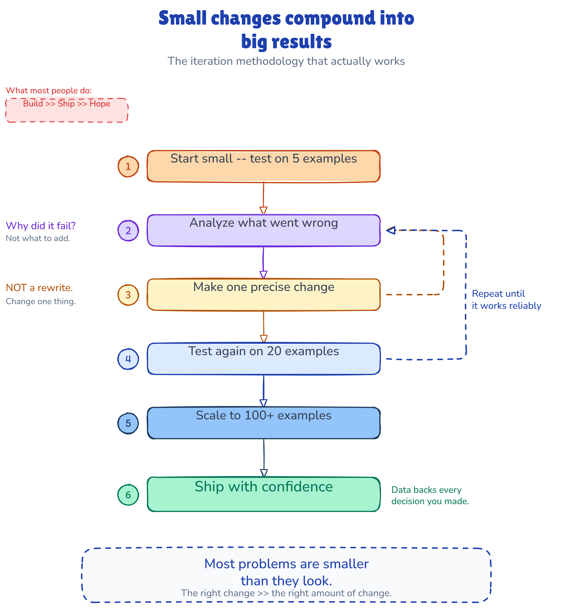
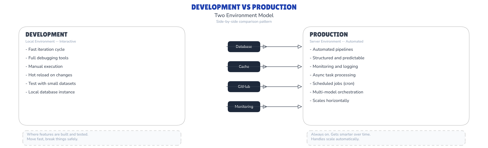
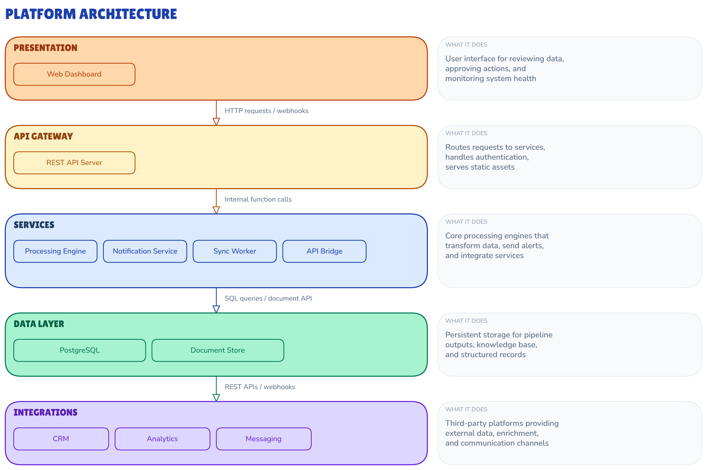
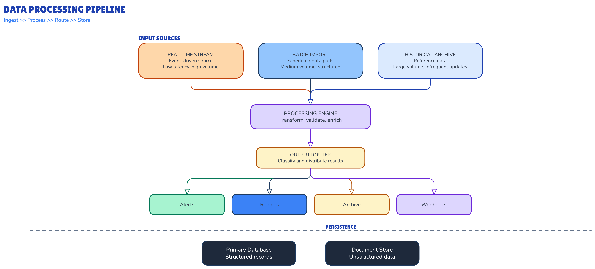

# Excalidraw Diagram Engine

Generate professional diagrams from natural language. Layout engine with arrow routing,
collision detection, typography system, and visual validation.

[](https://www.python.org/downloads/)
[](https://opensource.org/licenses/MIT)



> "Why not just use Mermaid?" -- Mermaid auto-generates generic diagrams from text.
> This engine generates diagrams that **argue visually**: custom typography, semantic
> colors, hand-crafted layouts, LinkedIn-ready output. Mermaid labels boxes.
> This engine tells stories.

## Quick Start

1. Copy `engine/` and `SKILL.md` to `.claude/skills/create-diagram/`
2. Tell Claude: "Create a diagram of [your topic]"
3. Claude generates, renders, validates, and iterates until correct

That's it. The SKILL.md teaches Claude how to use the engine.

## What Makes This Different

| Feature | This Engine | Mermaid | Basic Excalidraw Skill |
|---------|------------|---------|----------------------|
| Layout engine | 2,100+ lines with arrow routing | Auto-layout (no control) | Manual JSON placement |
| Arrow routing | Collision detection, elbow waypoints | Auto-routes (no control) | Manual coordinates |
| Visual quality | Publication-ready, semantic colors | Generic/functional | Basic shapes |
| Typography | 4-font hierarchy, calibrated widths | Single font | Single font |
| Validation | Section-by-section zoom inspection | None | Manual review |
| Patterns | 4 proven builders (pipeline, comparison, stack, LinkedIn) | Built-in chart types | None |
| Output | Excalidraw JSON + PNG (editable) | SVG/PNG (not editable) | Excalidraw JSON |
| Profiles | Client, internal, LinkedIn presets | None | None |

## Example Gallery

### Side-by-Side Comparison

Compare two approaches, architectures, or options. Shared elements in the center gap.
**Builder:** [`patterns/side-by-side.py`](patterns/side-by-side.py)

### Layered Architecture Stack

Horizontal layers with color gradient and description sidebar. Inner boxes show components.
**Builder:** [`patterns/layered-stack.py`](patterns/layered-stack.py)

### Complex Vertical Workflow

Convergence, processing, fan-out, and persistence. Three sources merge into one pipeline.
**Builder:** [`patterns/complex-workflow.py`](patterns/complex-workflow.py)

### LinkedIn Portrait (Numbered Sequence)

Portrait 4:5 format with numbered steps, side annotations, and iteration loop arrows.
**Builder:** [`patterns/linkedin-portrait.py`](patterns/linkedin-portrait.py)

## Architecture

```
diagram-engine/
  engine/
    layout_engine.py       # Core: 2,100+ lines, sections, nodes, arrows, profiles
    render_excalidraw.py   # Playwright renderer (JSON to PNG via SVG)
    render_template.html   # Browser template for Excalidraw's exportToSvg
    excalidraw_export.py   # Native PNG export via FSA intercept
    section_inspector.py   # Section-level zoom validation tool
  references/
    color-palette.md       # Semantic color system (customizable)
    json-schema.md         # Excalidraw JSON format reference
    arrow-patterns.md      # Arrow routing documentation
    element-templates.md   # Copy-paste JSON element templates
    visual-references.md   # Quality bar documentation
  patterns/
    side-by-side.py        # Comparison layout builder
    layered-stack.py       # Architecture stack builder
    complex-workflow.py    # Pipeline/workflow builder
    linkedin-portrait.py   # LinkedIn-optimized portrait builder
  examples/                # Generated .excalidraw + rendered .png files
  SKILL.md                 # Drop-in Claude Code skill file
```

## How It Works

The engine uses a **declarative API**:

```python
from layout_engine import Diagram

d = Diagram(profile="internal", title="My Pipeline")
with d.section("inputs", layout="row"):
    d.node("api", "API Gateway", style="trigger")
    d.node("queue", "Message Queue", style="primary")
with d.section("processing", layout="row"):
    d.node("worker", "Worker Service", style="ai")
d.connect("api", "worker")
d.connect("queue", "worker")
d.render("pipeline.excalidraw")
```

The engine computes all coordinates, arrow waypoints, text sizing, and collision avoidance automatically. Output is standard Excalidraw JSON that opens in excalidraw.com.

## Requirements

- Python 3.10+
- Playwright with Chromium (for rendering to PNG)

```bash
pip install playwright
playwright install chromium
```

## Using as a Claude Code Skill

Copy `SKILL.md` and the `engine/` folder to `.claude/skills/create-diagram/`. Claude Code will automatically use the engine when you ask for diagrams.

The skill includes:
- **Use case profiles** (client, internal, LinkedIn) with preset canvas sizes and typography
- **Visual pattern library** with proven builder scripts
- **Validation methodology** -- section-by-section inspection with structured reports
- **Hard rules** for professional output quality

## Using Without Claude Code

The pattern builders in `patterns/` are standalone Python scripts. Run any builder to generate an `.excalidraw` file, then render to PNG:

```bash
python patterns/linkedin-portrait.py
python engine/render_excalidraw.py examples/linkedin-portrait.excalidraw
```

Customize a builder by editing the layout constants and content at the top of each script.

## License

[MIT](LICENSE) -- use it however you want.
